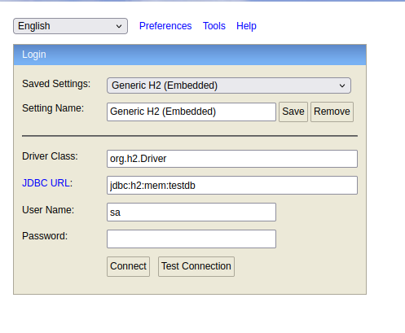

# crud com spring boot


Este projeto foi desenvolvido para praticar e demonstrar os fundamentos de uma **API REST** utilizando **Java** e **Spring Boot**.  
A aplicação implementa operações básicas de **CRUD (Create, Read, Update, Delete)** sobre a entidade **User**, permitindo criar, listar, atualizar e deletar registros de forma simples e eficiente.

Trata-se de um projeto de estudo, com banco de dados **H2 em memória**, criado para reforçar conceitos essenciais de desenvolvimento web e demonstrar boas práticas como:
- Tratamento centralizado de exceções com `@ControllerAdvice`.
- Padronização de respostas em formato JSON.
- Organização em camadas (`controller`, `service`, `repository`, `dto`, `exception`).
- Persistência de dados com **Spring Data JPA + Hibernate**.


## Tecnologias utilizadas
- Java 21
- Spring Boot 4.0.0 
    - Spring Web
    - Spring Data JPA
    - Lombok
    - Validation
    - H2 Database
- Maven 3.6.3
- VS code
- Postman

## Como rodar projeto
Clone o repositorio
```bash 
git clone https://github.com/vitor3211/crud.git
```
Entre no projeto
```bash
cd crud
```
Inicie a aplicação com o comando
```bash
mvn spring-boot:run
```
## API Endpoints
Para testar as requisições HTTP, foi utilizado o Postman.  
Os endpoints podem ser acessados em `http://localhost:8080/users` ou `http://localhost:8080/users/{id}`.

### Endpoints
```
GET /users - Listar todos usuários.
GET /users/{id} - Listar usuário pelo id.
POST /users - Criar novo usuário.
PUT /users/{id} - Atualizar usuário pelo id.
DELETE /users/{id} - Deletar usuário pelo id.
```

### Excemplos de requisições em JSON
- Criar usuário
    - URL: http://localhost:8080/users
    - METHOD: POST

Body:

```json
{
    "name": "Matheus",
    "email": "Matheus@gmail.com",
    "dateOfBirth": "2000-10-23"
}
```
Response:
```json
{
    "id": 1,
    "name": "Matheus",
    "email": "Matheus@gmail.com",
    "dateOfBirth": "2000-10-23"
}
```
- Listar todos usuários
    - URL: http://localhost:8080/users
    - METHOD: GET

Response:
```json
{
    "id": 1,
    "name": "Matheus",
    "email": "Matheus@gmail.com",
    "dateOfBirth": "2000-10-23"
}
```

- Atualizar usuário
    - URL: http://localhost:8080/users/1
    - METHOD: PUT

Body:
```json
{
    "name": "Lucas",
    "email": "Lucas@gmail.com",
    "dateOfBirth": "2010-02-12"
}
```
Response:
```json
{
    "id": 1,
    "name": "Lucas",
    "email": "Lucas@gmail.com",
    "dateOfBirth": "2000-10-23"
}
```

- Deletar usuário
    - URL: http://localhost:8080/users/1
    - METHOD: DELETE

Response:
```json
{


}
```

## Acessando banco de dados H2
Para acessar o banco de dados e ver os usuários cadastrados, precisamos realizar os seguintes passos:

1. Inicie a aplicação com 'mvn spring-boot:run'.
2. Abra seu navegador e acesse a seguinte URL: 'http://localhost:8080/h2-console'.

Irá aparecer a seguinte imagem:




3. Deixe as informações que nem na imagem e clique em 'Connect'.
4. Pronto! Agora você pode explorar o banco de dados H2 e consultar os usuários cadastrados.


## Licença
Este projeto foi criado para fins de estudo e pode ser utilizado livremente para qualquer propósito.
Fique à vontade para usar, modificar e compartilhar 😉